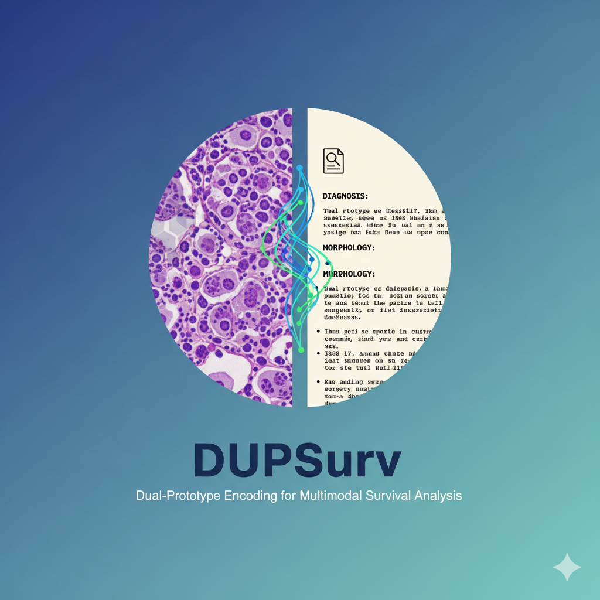
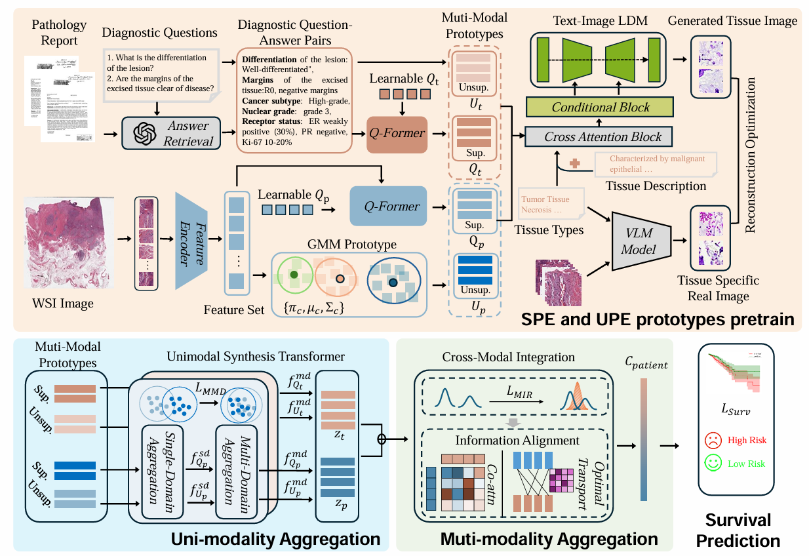

# DUPSurv

<b>Bridging Histopathology and Reports: A Dual-Prototype Encoding Approach for Multimodal Survival Analysis</b>
<br><em>Ruofan Zhang, Mengjie Fang, Shengyuan Liu, Shaoli Zhao,  Xin Feng, Xuyao Zhang, Lin Wu, Xuebin Xie, Jie Tian and  Di Dong</em></br>

This repository is the official implementation of DUPSurv (Bridging Histopathology and Reports: A Dual-Prototype Encoding Approach for Multimodal Survival Analysis)


## Table of Contents
- [Overview](#Overview)
- [Data preparation](#data-preparation)
- [Requirements](#requirements)
- [Training & Testing](#training--testing)
- [Acknowledgement](#acknowledgement)

## Overview



**Abstract:** Survival prediction plays a critical role in clinical decision-making, yet effectively integrating gigapixel whole slide images (WSIs) and pathology reports remains challenging due to their multimodal heterogeneity and scale disparities. Current approaches suffer from inefficient feature extraction from high-dimensional WSIs and suboptimal alignment between visual morphological patterns and textual diagnostic narratives. To address these challenges, we propose DUPSurv, a novel dual-prototype fusion framework that synergistically combines unsupervised and supervised prototype encoding for multimodal survival analysis. Our approach introduces four key innovations: (1) Unsupervised Prototype Encoding (UPE) that compresses thousands of WSI patches into representative morphological prototypes via Gaussian Mixture Models while extracting standardized question-answer pairs from unstructured reports using large language models; (2) Supervised Prototype Encoding (SPE) employing learnable Q-former structures with tissue-specific image generation tasks to capture diagnostic clues and enhance tissue heterogeneity representation; (3) Uni-Modal Aggregation (UMA) module leveraging a unimodal synthesis transformer for hierarchical prototype aggregation with maximum mean discrepancy alignment loss; and (4) Multi-Modal Aggregation (MMA) module utilizing a cross-modal integration component with mutual information reorganization for cross-modal feature synthesis. Extensive experiments on three TCGA cancer cohorts demonstrate that DUPSurv achieves superior performance over existing baselines, effectively bridging the gap between fine-grained histopathological details and high-level pathological narratives for accurate survival prediction. Our framework provides a principled solution for multimodal medical data integration with broad applicability to clinical prognostic modeling.





## Data Preparation

### WSIs
We used publicly available WSIs and patient information from [TCGA](https://www.cancer.gov/ccg/research/genome-sequencing/tcga). We preprocess whole slide image (WSI) data using [CLAM](https://github.com/mahmoodlab/CLAM), which provides an easy-to-use tool for WSI preprocessing. We use the [CLIP](https://github.com/openai/CLIP) image encoder as the patch-level feature extractor and store the extracted features in the `/path/to/patch_features` directory.

### Text Reports
TCGA provides diagnostic reports corresponding to each patient. The original text-based TCGA reports can be accessed from [TCGA Path Reports](https://github.com/tatonetti-lab/tcga-path-reports).

### Data Split
We adopt the same data split strategy as [MMP](https://github.com/mahmoodlab/MMP). You may modify and use your own data split file at `"/path/to/data_splits/k=${k}"`.

## Requirements

Install all required packages by running:
```shell
pip install -r requirements.txt
````

## Training & Testing

### 1. UPE Encoding Workflow

Run the following bash script and specify the required arguments to obtain pathological Gaussian prototypes:

```bash
bash ./UPE/pathology/scripts/prototype/BLCA_CLIP.sh gpu_id
```

Use the following script with a commercial LLM to generate corresponding question–answer pairs:

```python
UPE/report/question.py
```

We release the obtained question–answer pairs in the `report` folder to facilitate research in related fields.

### 2. SPE Encoding Workflow

Use tissue-specific templates based on PLIP to obtain tissue labels for each patch.
An example of the tissue template we used is provided below; you may replace it with your own specific template:

```shell
SPE/tissue_class/tissue_class_blca.json
```

Next, train the generative model based on tissue heterogeneity images. Replace the parameters with your own paths and settings, and modify the paths in `./SPE/train_ldm_vila.py`. Then run the training script:

```bash
bash SPE/train_t2i_vila.sh
```

### 3. UMA and MMA Multimodal Integration Workflow

We use UMA and MMA modules to perform intra- and inter-modal prototype fusion training. Replace the parameters with your own paths and settings, and modify the paths in `./UMA_MMA/main_survival_IBD.py`. Then run the following script:

```bash
bash UMA_MMA/scripts/survival/BLCA_CLIP.sh 0 IBDMMD_trans_256_alpha_beta
```

## Acknowledgement

The code for **DUPSurv** was adapted and inspired by the fantastic works of [PANTHER](https://openaccess.thecvf.com/content/CVPR2024/html/Song_Morphological_Prototyping_for_Unsupervised_Slide_Representation_Learning_in_Computational_Pathology_CVPR_2024_paper.html), [MMP](https://github.com/mahmoodlab/MMP), [CLAM](https://github.com/mahmoodlab/CLAM), and example code from the diffusers package.


